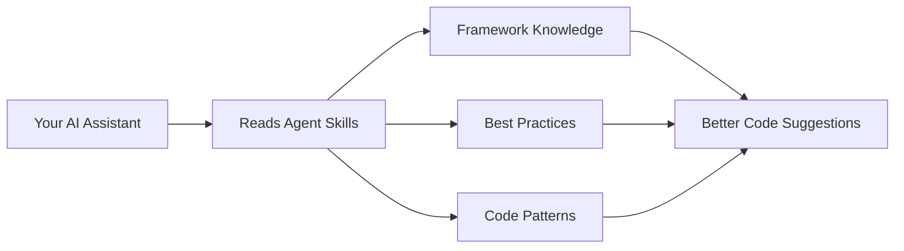

# Agent Skills


<!-- Badges -->
[](https://star-history.com/#unclecatvn/agent-skills&Date)

---

## What is Agent Skills?

**Agent Skills** is a collection of documentation and specialized agents that supercharge AI coding assistants like Cursor, Claude Code, Windsurf, and Aider.

Think of it as a "knowledge pack" - when you add Agent Skills to your project, your AI assistant gains access to thousands of lines of curated technical expertise about specific frameworks and technologies. This means better code suggestions, fewer mistakes, and more helpful responses.

### Why use it?

- **Generic AI assistants** give you general programming advice
- **AI assistants with Agent Skills** give you framework-specific, best-practice guidance

For example, instead of just getting "how to write a Python function," you get "how to write an Odoo model following Odoo 18.0 conventions with proper ORM usage."

---

## Quick Start

Get started in 30 seconds with NPX (recommended):

```bash
# Add Agent Skills to your current project
npx skills add unclecatvn/agent-skills
```

That's it! Your AI assistant will now have access to all the skills in this repository.

### Alternative: Manual Installation

```bash
# Install the CLI globally
npm install -g @unclecat/agent-skills-cli

# Initialize a specific skill (e.g., Odoo 19 for Cursor)
agent-skills init --ai cursor odoo --version 19.0
```

---

## What's Inside?

### Skills - Framework Documentation

In-depth guides written specifically for AI consumption:

| Skill | Description |
|-------|-------------|
| **[Odoo 18.0](skills/odoo/18.0/)** | Complete Odoo 18 development guide (ORM, OWL, Web Client, Performance) |
| **[Odoo 19.0](skills/odoo/19.0/)** | Complete Odoo 19 development guide with latest features |
| **[Brainstorming](skills/brainstorming/SKILL.md)** | Structured framework for feature ideation |
| **[MCP Builder](skills/mcp-builder/SKILL.md)** | Guide for building Model Context Protocol servers |

### Agents - Autonomous Reviewers

Specialized agents that act as senior technical leads:

| Agent | What it does |
|-------|--------------|
| **[Odoo Code Review](agents/odoo-code-review/SKILL.md)** | Automatically reviews Odoo code with scoring (1-10) and detailed feedback |
| **[Planner](agents/planner.md)** | Breaks down complex features into actionable implementation steps |

### Rules - Coding Standards

Enforced patterns for consistent, secure code:

| Rule | Description |
|------|-------------|
| **[Coding Style](rules/coding-style.md)** | Best practices for naming, imports, and code structure |
| **[Security](rules/security.md)** | Security patterns for enterprise applications |

---

## Project Structure

```
agent-skills/
├── skills/           # Framework documentation (Odoo, Brainstorming, MCP)
├── agents/           # Autonomous code reviewers and planners
├── rules/            # Coding standards and security patterns
└── lib/              # Shared resources and images
```

---

## Supported IDEs

Agent Skills works with popular AI-powered IDEs:

- **Cursor** - Full integration via CLI
- **Claude Code** - Native skill support
- **Windsurf** - Compatible
- **Aider** - Compatible

---

## How It Works



1. You add Agent Skills to your project
2. Your AI assistant reads the relevant skill files
3. The AI uses this context to provide framework-specific guidance
4. You get better, more accurate code assistance

---

## Stats

| Metric | Value |
|--------|-------|
| Documentation | 10,000+ lines |
| Skill Packs | Odoo 18.0, 19.0, Brainstorming, MCP |
| Agents | Code Reviewer, Planner |
| License | MIT |

---

## Contributing

We welcome contributions! Here's how you can help:

- **Add new skills** - Create documentation for other frameworks
- **Improve existing docs** - Fix errors, add examples
- **Create agents** - Build specialized reviewers or planners
- **Report issues** - Let us know what's missing or broken

See [CONTRIBUTING.md](CONTRIBUTING.md) for guidelines.

---

## Links

- [Issues](https://github.com/unclecatvn/agent-skills/issues)
- [Discussions](https://github.com/unclecatvn/agent-skills/discussions)
- [Releases](https://github.com/unclecatvn/agent-skills/releases)

---

_If you find this project helpful, please consider giving it a star!_

[](https://star-history.com/#unclecatvn/agent-skills&Date)
